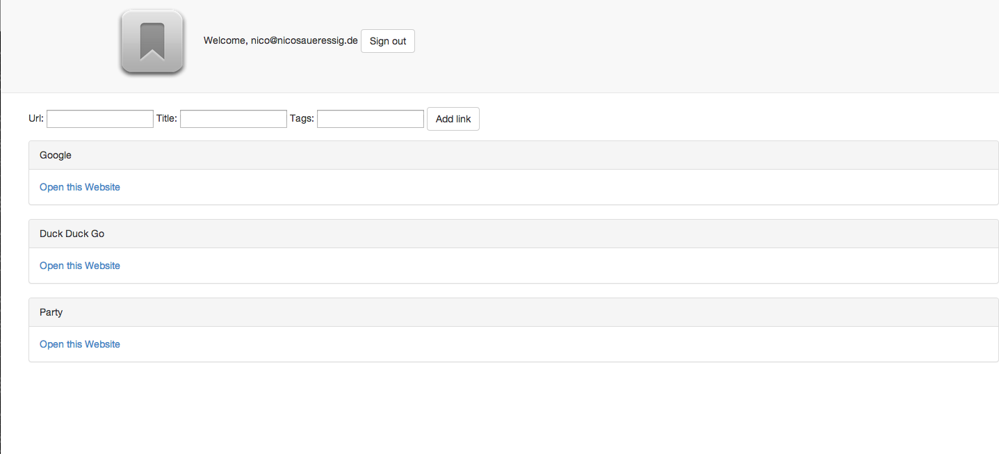

Bookmark-Manager
===
This was a challenge at Week 5 Makers Academy. We were supposed to build a Bookmark Manager in the vein of [Delicious.com]. Make an account, login, post links, recover your password if necessary.



What could be done
----
This exercise was in preparation of the [Chitter] exercise at Makers Academy.
- Frontend, responsivness
- Connecting individual views into a working website
- Uploading to Heroku
- Diverse validations

Objectives of exercise
----
Utilizing the Mailgun API and creating a fully functioning Sinatra app with everything that´s involved in that like a decent filestructure, not repeating yourself and readable code.
Technologies used
----
- Ruby
- Sinatra
- HTML5
- CSS3
- Git
- Heroku
- Postgresql
- jQuery
- Javascript
- Rspec
- Capybara
- Bcrypt
- [Mailgun API]
- Datamapper

How to run it
----
```sh
git clone git@github.com:NicoSa/Bookmark-Manager.git
cd Bookmark-Manager
shotgun -p 3000 server.rb
```
open localhost:3000 in your browser

How to run tests
----
```sh
cd Bookmark-Manager
rspec
```
[Mailgun API]:http://documentation.mailgun.com/quickstart.html
[Chitter]:https://github.com/NicoSa/Chitter
[Delicious.com]:https://delicious.com/
